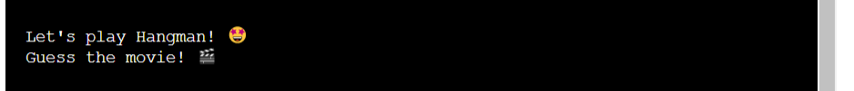
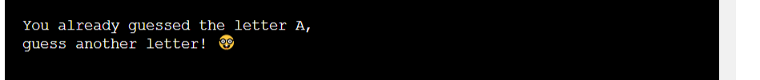

# Hangman Revolution

[View the live project here](https://hangman-revolution.herokuapp.com/)

[GitHub Repo](https://github.com/MichelleGri/hangman-revolution)

Hangman Revolution is a classic hangman game based on movies. The game aims to create an engaging and entertaining environment for the players. It is coded with Python and is played on the terminal on Heroku. The aim of the game is to guess the hidden movie title before 6 lives run out and the hangman drawing is completed.

The target audience for this game are people from 18 years and over who have an interest in movies and playing simple classic games. It challenges and tests the players' knowledge of popular movies. 

***

## Index - Table of Contents

* [User Experience (UX)](#user-experience)
* [Scope](#scope)
* [Flow Chart](#flow-chart)
* [Features](#features)
* [Technologies Used](#technologies-used)
* [Testing](#testing)
* [Deployment](#deployment)
* [Acknowledgements](#credit)

***

## User Experience (UX)

### User Stories

#### Reasons to play the game

* A user looking for a simple and classic game to play.
* A user wanting to play a game based on movies.
* A user looking for entertainment and enjoyment.

#### Aim of the game

* Provide an entertaining and engaging game for players

***

## Scope

#### User expectations
* Being able to easily navigate through the game
* Being able to easily understand how to play the game
* Have an entertaining experience

#### As a developer, I want to provide
* A simple and easy to play game with all game functionality working as expected
* Simple and easy to follow instructions
* Entertain and engage the player

***

## Flow Chart

A flow chart was created using Lucidchart to explain the game flow and logic:

***

## Features

### Logo

The logo has been created with ASCII art, using the website [Patorjk](https://patorjk.com/software/taag/#p=display&f=Graffiti&t=Type%20Something%20). It appears at the top of the game and remains there throughout the course of the game. 

### Welcome message

To maintain simplicity, the welcome message displays "Let's play Hangman!"

### Game area

The game area includes a drawing of hangman with ASCII art, which will be updated as the player loses lives. 

The movie title is represented with empty underscores / dashes. These will be updated as the player guesses correct letters corresponding to their position in the movie title. 

The player is prompted to guess a letter, which is displayed under the prompt. 

### Game messages

As the game progresses, the welcome message is updated with the following messages:

When the player guesses a correct letter:           "Well done! The letter (guessed letter) is in the movie!"

When the player guesses an incorrect letter:        "The letter (guessed letter) is not in this movie!"

When the player enters a letter already guessed:    "You already guessed the letter (guessed letter)  guess another letter!"

When the player guesses the movie:  "Congratulations! You guessed the correct movie!"

When the player loses the game: "You lost the game! The movie was (movie title)!

When the player enters an invalid guess:    "Invalid guess, please enter one letter from A to Z only!

### Result

The game ends once the player guesses the correct movie title, and the game is won.

The game ends if the player enters 6 incorrect guesses, and the game is lost.

The player is asked if they would like to play again with displaying the following message: "Do you want to play again? Y/N:"

If the player enters "Y", the game restarts with a different random movie.

If the player enters "N", the following message is displayed: "Thank you for playing Hangman Revolution!"

If the player enters an invalid response, the following message is displayed: "Invalid input ... enter Y to play again or N to exit"

***

## Technologies Used

- Python
- [Python Checker:](https://www.pythonchecker.com/) Checking code for Python requirements.
- [Lucidchart:](https://www.lucidchart.com/pages/) To create the game flow chart.
- [Git](https://git-scm.com/) Gitpod is used to write code, make commits, and push code to GitHub.
- [GitHub:](https://github.com/) GitHub is used to create a project repository. 
- [Heroku:](https://dashboard.heroku.com/) Used to deploy the project.

***

## Testing

### Python Checker Code Validator

[Python Checker](https://www.pythonchecker.com/) was used to check the validity of the code. The code passed the validator with 99%. The image below displays the result:

### Further Testing

#### Testing by game developer:

- Game area display is as expected with all elements appearing where and when expected.
- The game follows a logical flow with all functionality working as and when expected.
- The game messages are displayed clearly and appear according to game logic. 
- Underscore blanks appear corresponding to a random chosen movie.
- Underscore blanks are updated with correct letters when player enters a correct guess.
- Hangman is updated with correct drawings when player enters an incorrect guess.
- Game ends when the player wins or loses the game.
- Player is asked if they would like to play again when game ends.

#### Bugs

Currently, there are no known bugs within the game.

***

## Deployment

The project has been deployed to Heroku: [The Hangman Revolution](https://hangman-revolution.herokuapp.com/).

1. Sign-up for a free account on Heruko.
2. Login to Heroku.
3. Click on "Create new app".
4. Enter an app/project name and choose a region.
5. Click on "Create app".
6. Navigate to 'Settings' tab.
7. Click on "Reveal Config Vars".
8. Add Config Var in Heroku's Settings - Key: PORT, Value: 8000.
9. Scroll to "Buildpacks".
10. Click on "Add Buildpack".
11. First add "Python", click on 'Save'.
12. Second add "Nodejs", click 'Save'.
    (Ensure 'Python' is before (first) 'Nodejs' (second) - drag and rearrange if required)
13. Navigate to 'Deploy' tab.
14. Select 'GitHub' from 'Deployment method'
15. Click on 'Connect to GitHub'
16. Search for the GitHub repository name, and click on 'Connect'
17. Click on 'Deploy Branch'
18. Click on 'View' - this will open a new tab with the deployed app / project

### Enable automatic deployment to Heroku
Follow the steps below to enable automatic deployment to Heroku from Gitpod:

- Open the terminal
- command: heroku login -i
- Enter your credentials - email and password
- Get your app name from heroku
- command: heroku apps
- Set the heroku remote. (Replace <app_name> with your actual app name and remove the <> characters)
- command: heroku git:remote -a <app_name>
- Add and commit any changes to your code if applicable
- command: git add . && git commit -m "Deploy to Heroku via CLI"
- Push to both GitHub and Heroku
- command: git push origin main
- command: git push heroku main

***

## Acknowledgements

### Credit

Brian Macharia - I would like to thank my mentor Brian Macharia for his valuable feedback and suggestions. His guidance enabled me to plan and execute the project. 

#### Media

[Dr. Angela Yu](https://www.udemy.com/course/100-days-of-code/) – Udemy Course - 100 Days of Code: The Complete Python Pro Bootcamp for 2022 – for providing valuable videos on various Python topics

[Programming with Mosh](https://www.youtube.com/c/programmingwithmosh) – YouTube Channel – for providing informative videos on various Python topics

[Lucidchart:](https://www.lucidchart.com/pages/) - used to create game flow chart

[Stack Overflow](https://stackoverflow.com/) – for trouble shooting and resolving code issues

[W3school](https://www.w3schools.com/) – for Python coding information and trouble shooting

[Python Checker](https://www.pythonchecker.com/) - for checking Python code validity

[Patorjk](https://patorjk.com/software/taag/#p=display&f=Graffiti&t=Type%20Something%20) - for creating logo ASCII art

[Chris Horton](https://gist.github.com/chrishorton/8510732aa9a80a03c829b09f12e20d9c) - GitHub - for hangman ASCII art

***

### Content

Code and Content (not already attributed): Michelle Griffiths

